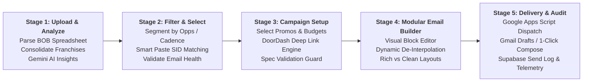
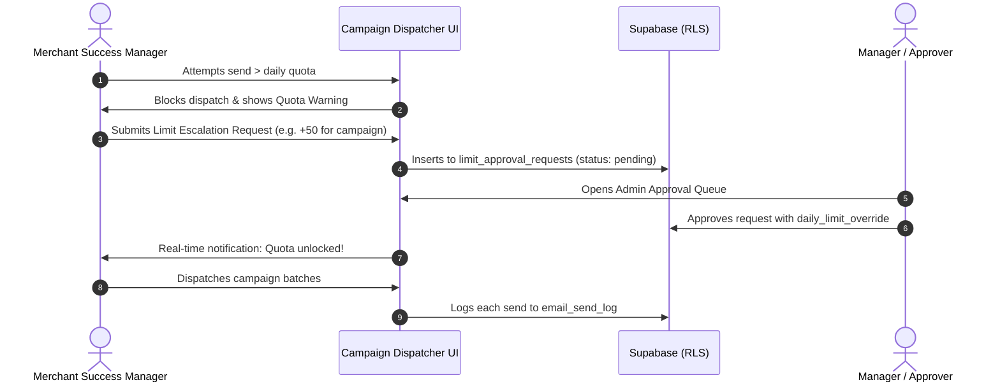

<div align="center">

# 🚀 MSM Campaign Dispatcher

**Enterprise Merchant Promo Automation & High-Volume Outreach Engine for DoorDash Merchant Success Managers**

[](https://react.dev/)
[](https://vitejs.dev/)
[](https://tailwindcss.com/)
[](https://supabase.com/)
[](https://script.google.com/)
[](https://deepmind.google/technologies/gemini/)
[](https://nodejs.org/)

<p align="center">
  <b>Transform raw Book of Business (BOB) spreadsheets into personalized, high-converting merchant marketing campaigns in minutes — with zero infrastructure cost, 100% compliant DoorDash deep links, and native corporate Gmail deliverability.</b>
</p>

[Key Features](#-key-features) • [Workflow](#-the-5-stage-pipeline) • [Deep Link Engine](#-doordash-deep-link-contract) • [Architecture](#-architecture--tech-stack) • [Quickstart](#-quickstart--local-setup) • [GAS Deployment](#-google-apps-script-deployment) • [Database & RBAC](#-security--rbac-specification)

---

</div>

## 📌 Executive Summary

For DoorDash Merchant Success Managers (MSMs), driving merchant adoption of DoorDash promotional products (Sponsored Listings, Smart Campaigns, BOGO, Free Delivery, Discounts, and Loyalty) is critical for merchant growth. However, manual execution is severely bottlenecked:

* **Complex Data Consolidation:** Spreadsheets contain fragmented multi-location stores, duplicate contacts, and inconsistent email fields.
* **Error-Prone Deep Links:** Constructing DoorDash Merchant Portal deep links requires exact penny-cents math, comma-separated store IDs (`sids`), audience targeting flags, and assisted rep attribution (`assisted_rep_id`). A single typo breaks the campaign tracking or merchant landing page.
* **Deliverability & Cost Hurdles:** Commercial mass-emailing tools cost thousands, get flagged by corporate spam filters, or strip rep attribution.
* **Template Rigidity:** Reps need to tailor emails for specific franchise groups while preserving dynamic merchant-specific deep links when syncing changes across the entire campaign.

**MSM Campaign Dispatcher** solves this end-to-end. It runs as a client-side web application coupled with a serverless Google Apps Script bridge and Supabase database. Reps can parse their Book of Business, receive AI-guided campaign recommendations, configure promos with mathematical precision, visually craft responsive emails with dynamic token de-interpolation, and dispatch hundreds of personalized emails directly from their authenticated DoorDash Google Workspace account.

---

## ⚡ Key Features

### 📊 1. Book of Business (BOB) Intelligence Suite
* **Multi-Location Franchise Consolidation:** Automatically collapses dozens of store locations under a single `business_id` while aggregating store IDs (`sids`) and extracting primary Decision Maker (DM) emails.
* **Fuzzy Header Recognition:** Seamlessly parses XLSX and CSV exports from DoorDash portals without requiring strict column names.
* **Opportunity & Credit Detection:** Auto-flags merchants with active Sponsored Listing Credits (`sl_credit`), Sponsored Listing Opportunities (`sl_opp`), Promo Opportunities (`promo_opp`), and Loyalty Opportunities (`loyal_opp`).
* **Visual & Touch Analytics:** Analyzes cell fill colors from Excel formatting, tracks outreach cadence/touch frequency, and renders interactive Recharts distribution dashboards.
* **Gemini AI Strategy Advisor:** Integrates Google Gemini to analyze merchant cohorts, suggest pitch angles, and prioritize high-yield outreach targets (with automated PII stripping before sending).

### 🔗 2. Golden-Contract Deep Link Builder
* **DoorDash Spec Compliant:** Implements and enforces the exact DoorDash Merchant Portal URL specification frozen by golden snapshot tests (`deepLinkBuilder.golden.test.js`).
* **Full Campaign Catalog:**
  * **Smart Campaign:** Real-time personalized customer discounts (`smart_campaign`).
  * **Sponsored Listings (Ads):** Featured placement with weekly budget caps (`ads`).
  * **BOGO:** Buy-one-get-one promotions with item ID aggregations (`bogo`).
  * **Free Delivery:** Zero-dollar delivery fee promotions (`delivery_fee`).
  * **Tailored Discounts:** Custom % or $ off with subtotal minimums and discount caps (`discount`).
  * **Dayparting Promos:** Happy Hour (2–5 PM) and Lunch Specials (11 AM–2 PM).
  * **Loyalty Programs:** Repeat-order rewards (`loyalty`).
  * **Blank / Custom Outreach:** Free-form communication with no promotional attachments.
* **Strict Calculation Integrity:** Handles exact cents conversions (`Math.round(... * 100)`), comma-separated URL encoding (`%2C`), and assisted rep attribution (`assisted_rep_id`).

### ✍️ 3. Modular Visual Email Builder & Dynamic De-Interpolation
* **Component-Based Email Blocks:** Composes emails using typed blocks: Text, Promo Callouts, Credit Alerts, CTAs, and Dynamic Signatures.
* **Dynamic Token De-Interpolation:** Edit any merchant's email in the WYSIWYG editor and click **"Apply to All"**. The engine automatically extracts and preserves dynamic tokens (`%%DD_LINK_<promoId>%%`, `{Store Name}`, `{DM Name}`), preventing merchant-specific deep links from bleeding into other stores.
* **Dual Output Modes:**
  * **Rich HTML:** Fully responsive, table-based layouts compatible with Microsoft Outlook, Apple Mail, and mobile clients.
  * **Clean / Minimalist HTML:** Unstyled, 1:1 human-looking email copy engineered for maximum reply rates and inbox placement.
  * **Plain Text:** Clean fallback text for non-HTML mail clients.
* **Rich Signature Designer:** Built-in WYSIWYG signature editor with 8-point draggable image resize handles and formatting controls.

### 🚀 4. Multi-Channel Dispatch Engine
* **Zero-Cost Google Apps Script (GAS) Webhook Bridge:** Sends batches directly through the rep's corporate Gmail account via a lightweight serverless endpoint (`gas/Code.gs`), maintaining native sender reputation.
* **Gmail Drafts Generation:** Create draft emails directly in Gmail for rep review prior to dispatch.
* **1-Click Gmail Desktop Bridge:** Pre-fills `To`, `CC`, and `Subject` in Gmail while copying rich formatted HTML to the clipboard for instant `Ctrl+V` pasting.
* **Comprehensive Excel Export:** Downloads full campaign rosters with pre-computed deep links, subject lines, and draft bodies for mail merge or recordkeeping.

### 🛡️ 5. Enterprise Security & Multi-Tier RBAC
* **Passwordless OTP Authentication:** Restricts login strictly to whitelisted DoorDash rep emails using Supabase Magic Link / OTP.
* **3-Tier Permission Hierarchy:**
  * `rep`: Standard MSM. Manages personal settings, generates campaigns, dispatches within daily limits, requests quota bumps.
  * `manager`: Team Lead. All Rep abilities plus pending approval queue to review and grant daily email limit overrides.
  * `ultimate`: Platform Admin. Organization-wide telemetry, user whitelist management, role assignments, and global audit logs.
* **Row-Level Security (RLS):** Database-level PostgreSQL isolation ensures reps cannot read or modify another rep's API keys, GAS endpoints, or send logs.
* **Daily Quota & Escalation Guard:** Prevents spam and protects corporate Gmail deliverability with customizable daily send quotas and in-app manager approval workflows.

---

## 🔄 The 5-Stage Pipeline



### Stage Walkthrough:
1. **Upload & Intelligence:** Drop a DoorDash Book of Business (XLSX/CSV). The parser groups multi-unit stores under their respective `business_id`, detects column mappings, parses color codes, and provides high-level opportunity metrics alongside Gemini AI strategic recommendations.
2. **Review & Selection:** Filter target merchants using quick opportunity badges (SL Opp, Promo Opp, Loyalty Opp), search queries, status badges, or bulk SID paste. Clean or correct email addresses per merchant.
3. **Configure Promos:** Choose up to 3 marketing promotions or a Blank Email. Configure budgets, discounts, subtotal minimums, and durations. The system constructs verified deep links adhering to DoorDash's URL contract.
4. **Draft & Customize:** Review rendered emails across all merchants. Customize copy globally or per-merchant using rich blocks or clean text. Changes applied across all merchants preserve placeholder tokens safely.
5. **Dispatch & Track:** Send batches via Google Apps Script (with real-time progress counters), create Gmail drafts, or copy to clipboard for manual sending. All dispatches are logged to Supabase with rep attribution.

---

## 📐 Architecture & Tech Stack

```
MSM-Campaign-Dispatcher/
├── src/
│   ├── components/            # UI Views, Modals, and Dashboard Widgets
│   │   ├── dashboard/         # Executive telemetry, trend charts, rep utilization
│   │   ├── AdminPanel.jsx     # Whitelist management, role toggles, quota approvals
│   │   ├── BOBDashboard.jsx   # Opportunity donuts, touch cadence, Gemini advisor
│   │   ├── DeliveryPanel.jsx  # Multi-mode delivery, GAS queue, quota guard
│   │   ├── EmailPreview.jsx   # Live email canvas, theme selector, mode toggles
│   │   ├── MerchantEmailEditor.jsx # WYSIWYG editor with dynamic token de-interpolation
│   │   ├── MerchantTable.jsx  # Consolidated merchant table with smart filters
│   │   ├── PromoCustomizer.jsx# Promo parameter inputs & contract validator
│   │   ├── PromoSelector.jsx  # 8-card promotional catalog selector
│   │   ├── RepSettingsModal.jsx # Rep ID, GAS URL, Gemini Key, rich signature
│   │   └── UploadZone.jsx     # Drag-and-drop Excel/CSV parser
│   ├── lib/                   # Core business logic & frozen contracts
│   │   ├── deepLinkBuilder.js # ⚠️ FROZEN DoorDash URL builder contract
│   │   ├── emailBlockEngine.js# Block compiler, HTML sanitization, token engine
│   │   ├── bobAnalyzer.js     # Excel styling extraction, cadence detection, AI prompts
│   │   ├── bobParser.js       # Spreadsheet row parsing & multi-SID deduplication
│   │   ├── repSettingsStore.js# Supabase settings sync + local cache fallback
│   │   ├── supabase.js        # Supabase client, queries, RPCs, auth helpers
│   │   └── analytics.js       # Rep session tracking & feature telemetry
│   ├── App.jsx                # Main 5-phase application controller & state machine
│   └── main.jsx               # Auth gate, OTP verification, session tracker
├── gas/
│   ├── Code.gs                # Serverless Google Apps Script backend
│   └── README.md              # GAS deployment instructions
└── supabase-migrations/       # PostgreSQL schema, RLS policies, and RPC definitions
```

### Technology Matrix

| Layer | Technology | Purpose |
| :--- | :--- | :--- |
| **Frontend Framework** | React 18 + Vite 5 | Fast Single-Page Application with instant state transitions |
| **Styling & Icons** | Tailwind CSS v4 + Lucide React | Modern, clean, accessible enterprise design system |
| **Data Visualizations** | Recharts | Opportunity distribution donuts, touch cadence histograms |
| **Spreadsheet Engine** | SheetJS (`xlsx`) | Client-side Excel reading with cell fill color extraction |
| **Database & Auth** | Supabase (PostgreSQL 15) | Passwordless OTP auth, RLS tenant isolation, stored procedures |
| **Serverless Dispatch** | Google Apps Script (`Code.gs`) | Direct corporate Gmail delivery with zero API subscription cost |
| **AI Copilot** | Google Gemini 1.5 / 2.0 | Tactical cohort recommendations and email pitch copywriting |
| **Test Suite** | Node.js Native Test Runner | Golden-file deep link regression and contract validation tests |

---

## 🔒 DoorDash Deep Link Contract

> [!IMPORTANT]
> `src/lib/deepLinkBuilder.js` is a **frozen DoorDash contract, not standard app logic**. It reflects the exact URL parameters, encoding, and calculations required by the DoorDash Merchant Portal.

### Contract Invariants:
1. **Never edit `src/lib/deepLinkBuilder.js`** — all promo URL adjustments must happen at call sites via null-guards (`?? []` / `?? {}`), passing parameters verbatim.
2. **Cents Precision:** Currency values are multiplied by 100 and rounded (`Math.round(val * 100)`). A value of `1400` corresponds to `$14.00`.
3. **Delimiter Encoding:** Store IDs (`sids`) are strictly encoded with `%2C` delimiters.
4. **Attribution:** The `assisted_rep_id` parameter ensures sales performance credit is properly assigned to the MSM.
5. **Contract Golden Tests:** Verified by `src/lib/__tests__/deepLinkBuilder.golden.test.js`. Any breaking changes in URL shape or param order will fail the test suite.

```bash
# Run contract verification tests
npm test
```

---

## 🛡️ Security & RBAC Specification

The platform utilizes a defense-in-depth security model combining Supabase Row-Level Security (RLS) with application-level role enforcement.

```
┌────────────────────────────────────────────────────────┐
│                   reps_whitelist                       │
├─────────────┬──────────────────────────────────────────┤
│ rep         │ Standard Merchant Success Manager        │
│ manager     │ Team Lead / Quota Approver               │
│ ultimate    │ Platform Administrator / System Owner    │
└─────────────┴──────────────────────────────────────────┘
```

### Permissions Matrix

| Capability / Resource | `rep` | `manager` | `ultimate` | Security Mechanism |
| :--- | :---: | :---: | :---: | :--- |
| **Manage Personal Settings** | ✅ (Own) | ✅ (Own) | ✅ (Own) | RLS: `lower(rep_email) = lower(auth.jwt()->>'email')` |
| **Dispatch Campaigns** | ✅ (Up to limit) | ✅ (Up to limit) | ✅ (Unrestricted) | Client + DB Quota Check |
| **Request Quota Escalation** | ✅ | ✅ | — | Inserts to `limit_approval_requests` |
| **Approve / Deny Quotas** | ❌ | ✅ (Assigned) | ✅ (All) | RLS on `limit_approval_requests` |
| **View Audit Send Logs** | ✅ (Own) | ✅ (Own) | ✅ (All Org) | RLS on `email_send_log` |
| **Manage Rep Whitelist** | ❌ | ❌ | ✅ | RLS: `role = 'ultimate'` on `reps_whitelist` |
| **Platform Telemetry** | ❌ | ❌ | ✅ | Real-time session analytics & active rep tracking |

---

## 🚀 Quickstart & Local Setup

### Prerequisites
* **Node.js** 18.x or higher
* **npm** 9.x or higher
* A **Supabase** project
* A **Google Workspace** account (for Google Apps Script email dispatch)

### 1. Clone the Repository
```bash
git clone https://github.com/your-org/msm-campaign-dispatcher.git
cd msm-campaign-dispatcher
```

### 2. Install Dependencies
```bash
npm install
```

### 3. Configure Environment Variables
Create a `.env.local` file in the project root:

```env
VITE_SUPABASE_URL=https://your-project.supabase.co
VITE_SUPABASE_ANON_KEY=eyJhbGciOiJIUzI1NiIsInR5cCI6IkpXVCJ9...
```

### 4. Run Database Migrations
Execute the SQL migration scripts in your Supabase SQL Editor in numerical order:
1. `supabase-migrations/001_rep_settings.sql` — Base settings table & RLS policies
2. `supabase-migrations/002_set_my_rep_id.sql` — Rep ID mirroring RPC
3. `supabase-migrations/003_rep_settings_case_insensitive.sql` — Case-insensitive email indexing
4. `supabase-migrations/004_fix_rep_settings_permissions.sql` — Stored procedures for settings sync

Seed an initial administrator in `reps_whitelist`:
```sql
INSERT INTO public.reps_whitelist (email, name, role, is_active, daily_email_limit)
VALUES ('your.email@doordash.com', 'Your Name', 'ultimate', true, 100);
```

### 5. Launch the Development Server
```bash
npm run dev
```
Open [http://localhost:5173](http://localhost:5173) in your browser.

### 6. Run Automated Tests
```bash
npm test
```

---

## 📬 Google Apps Script Deployment

Because the application runs client-side to maintain zero infrastructure overhead, it uses Google Apps Script (GAS) to deliver emails directly via the rep's corporate Gmail account.

1. Navigate to [script.google.com](https://script.google.com) and click **New Project**.
2. Replace all code in `Code.gs` with the contents of [gas/Code.gs](file:///d:/DoorDash/Merchant%20Promo%20and%20Email%20Bulk%20Sender/MSM%20Campaign%20Dispatcher/gas/Code.gs).
3. In the top right, select **Deploy** > **New Deployment**.
4. Click the gear icon next to "Select type" and choose **Web App**.
5. Configure the deployment parameters:
   * **Description:** `MSM Campaign Dispatcher API`
   * **Execute as:** `Me (your DoorDash account)`
   * **Who has access:** `Anyone` *(required for the browser to POST without cross-origin OAuth prompts)*
6. Click **Deploy** and complete the Google authorization grant for Gmail access.
7. Copy the generated **Web App URL**.
8. In the MSM Campaign Dispatcher application, click **⚙ Settings** and paste the URL into **Google Apps Script Web App URL**.

---

## 📊 Daily Sending Limits & Quota Escalation

To safeguard sender reputation and avoid triggering Gmail bulk sending throttles, reps have a daily sending budget (default: 50 emails/day).



---

## 🛠️ Verification & Development Commands

```bash
# Start local Vite development server
npm run dev

# Run DoorDash deep link contract tests
npm test

# Build production bundle for deployment
npm run build

# Preview production build locally
npm run preview

# Run ESLint validation
npm run lint
```

---

## 📄 License & Attribution

Internal Tool — Developed for DoorDash Merchant Success Management teams.  
All promotional URL specifications and parameter rules are proprietary to DoorDash.
